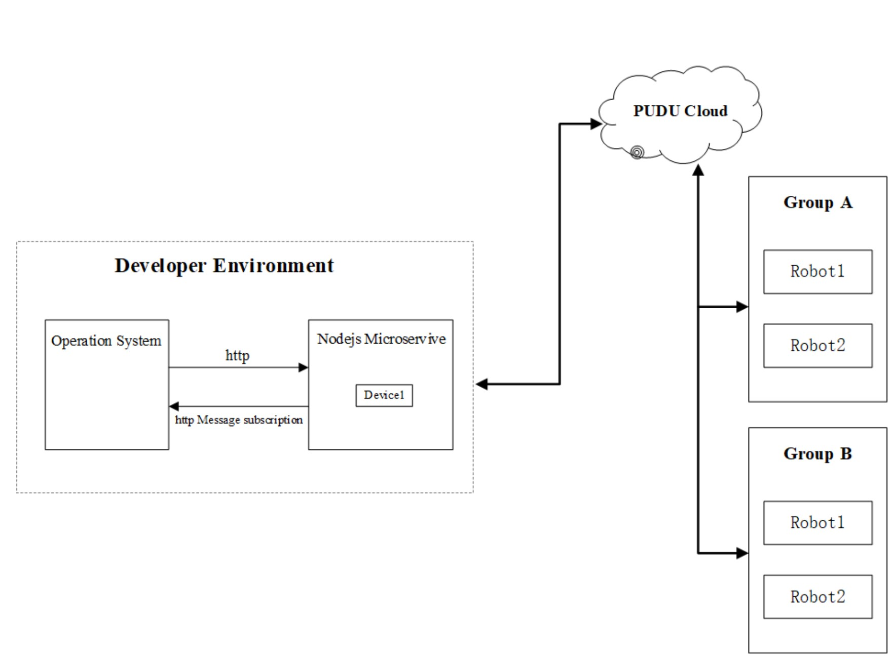
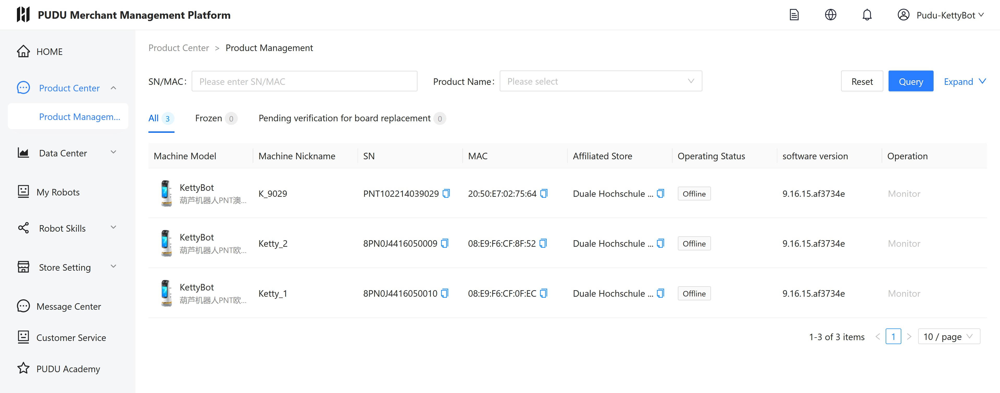

# Autonomer Pudu Kettybot-Roboter

 

**Neue Konzepte**  
**Projektdokumentation**

**Dennis Eisele, Abdel Hassan, Daniele Risorgi und David Berezowski**

*Datum*

Kurs: TIF22A  
Projektbetreuer: Felix Hanser

# Hinweis zum Umfang der Arbeit
Der Textteil der vorliegenden Arbeit - beginnend mit der Einleitung bis ausschließlich Quellenverzeichnis - umfasst ? Seiten. <!-- TODO: Seitenanzahl einfügen -->

# Kurzfassung
TODO

# Infrastruktur

## Anfrage Struktur
Die PuduTech Open Platform für Roboterservices implementiert eine  Software-Infrastruktur, die auf einem Microservice-SDK-Modell basiert. Diese Architektur ermöglicht eine nahtlose Integration von Robotersystemen in bestehende Software-Ökosysteme durch standardisierte Kommunikationsprotokolle.

Das System folgt einem Client-Server-Modell, bei dem der Microservice-SDK-Server, welcher auf Betriebssystemen wie Linux, MacOS und Windows nutzbar ist, als Vermittler zwischen Entwickleranwendungen und der Pudu Cloud fungiert. Die Kommunikation basiert auf dem HTTP-Protokoll mit GET- und POST-Methoden für den Datenaustausch. 

    

Infrastruktur der API-Schnittstelle

Um die Pudu-Roboter via API zu steuern, muss der Entwickler zunächst den Microservice-SDK bereitstellen und starten. Bei der ersten Nutzung des MicroService muss eine DeviceID und ein Passwort angegeben werden, um sich zu authorisieren. Außerdem muss die API-Funktion auf jedem Roboter in den Zugriffseinstellungen freigeschaltet werden. 

Nun können Anfragen an den MircoService, beispielsweise per Postman, geschickt werden. Der MicroService leitet diese Anfrage dann weiter an die Pudu-Cloud, welche dann die Befehele den Robotern direkt übergibt. In den meisten Anfragen muss die DeviceID und spezifische RoboterID mitgegeben werden. 
Hat diese Übermittlung funktioniert, erhält das Endgerät mit der die Anfrage an den MicroService gestellt wurde eine "Success"-Benachrichtigung.

Für die Ansteuerung einzelner Module gibt es verschiedene IDs:
- DeviceID: Die DeviceID identifiziert den Store, also in dem Fall alle Roboter und deren zugewiesene Gruppe im Labor der DHBW
- GroupID: Die GroupID ermöglicht es verschiedene Roboter Gruppen anzusteuern. Die Gruppierung der Roboter ist im Pudu-Cloud Management Tool zu steuern, worauf folgend eingegangen wird.
- RobotID: Die RobotID ist zur spezifischen Antsteuerung bestimmter Roboter zu verwenden. 

## Pudu-Cloud Management Tool

Das Pudu-Cloud Management Tool ist eine Weboberfläche zur allgemeinen Einsicht des eigenen Stores, also der eignen Infratruktur der Roboter als Netzwerk . Für den Zugriff darauf benötigt man einen Account, welcher uns von TCO-Robotics bereit gestellt wurde. Dieses Unternehmen gilt als Vermittler zwischen dem Kunden, der die Roboter anschafft und Pudu-Robotics. 

In dem Pudu-Cloud Management Tool gibt es eine Übersicht über die Roboter im Store (DeviceID), Statistiken zur Nutzung dieser und spezifische Einstellung zur Advertisement-Screen Anzeige, Roboterstimme und Anzeige für Kunden auf dem Controlpanel oben am Pudu. Genannte Anzeige ermöglicht die Dartstellung spezieller Angebote auf dem Screen oder der Funktion den Kunden an einen Tisch zu führen.

    

Infrastruktur der API-Schnittstelle

## 

# Karten
## Allgemeine Informationen
Eine Karte, wie sie in einem Pudu Kettybot gespeichert ist, ist eine digitale Repräsentation der Umgebung, die der Roboter für Navigation nutzt. Karten enthalten Wegpunkte und andere Knoten.

    

Karte auf dem Kettybot

### Wegpunkte
Wegpunkte sind für den Roboter Ziele, zu denen er fahren kann. Diese werden im
Lieferungsmenü des Roboters angezeigt und lassen sich als eine Reihe von Zielen auswählen, zu denen der Roboter nacheinander hinfahren wird, bevor er wieder zur Ursprungsposition zurückfährt. Für Pudu Kettybots können bis zu 3 Wegpunkte für eine Tour ausgewählt werden.

    

Lieferungsmenü mit Zielen

## Karten erstellen
### Voraussetzungen
Damit ein Kettybot eine Karte erstellen bzw. einscannen kann, ist zwingend eine Installation eines Markers nötig.

    

Marker an der Decke von A335

Der Marker markiert den Startpunkt bzw. Rastplatz der bzw. des Kettybots.

### Erstellung mithilfe des MappingTools
Um eine Karte zu erstellen wird das *MappingTool* auf den Kettybots verwendet.

Das MappingTool kann durch folgendermaßen gestartet werden:
> Einstellungen → Debug-Menü (Standardpasswort: `pudupw`) → Tools → RunToMappingTool

    

MappingTool

Durch einen Klick auf *Add* kann nun eine neue Karte gescannt werden.

Nun muss zunächst *Marker(ceiling yard)+Laser Mapping* und danach der Marker-Typ *V7* ausgewählt werden.

Anschließend muss der Roboter zur Startposition geführt werden, um den Kartenerstellungsprozess zu starten. Folge den Anweisungen auf dem Display des Kettybots.

    

Der Kettybot ist bereit, um eine Karte einzuscannen

Der Roboter kann nun langsam vom Benutzer geschoben werden, wobei der gesamte Bereich der Karte abgefahren werden sollte, die der Roboter später befahren soll. Wichtig ist hier, dass der abgefahrene Weg im Kettybot als potenzielle Route gespeichert wird. Deshalb muss sichergestellt werden, dass die abgefahrene Routen immer zugänglich sind. Falls zu einem späteren Zeitpunkt Gegenstände wie zum Beispiel Stühle die abgefahrenen Routen blockieren, kann dies zu Problemen führen. Zum Beispiel kann der Kettybot beim Befahren einer blockierten Route sich so verhalten, dass er nicht zum Ziel findet und auch keine anderen Routen in Betracht zieht.

Während dem Abfahren der Route kann der Benutzer Wegpunkte hinzufügen, die später als Ziele zur Verfügung stehen. Dazu positioniert der Benutzer den Kettybot an den gewünschten Wegpunkt und fügt diesen über die Benutzerfläche des MappingTools dem Roboter hinzu, in dem er auf den Button *Add point* klickt, dem Wegpunkt einen Namen vergibt, den Typ des Punkts als *Destination* festlegt und schließlich bestätigt.

Falls alle Bereiche der Karte abgefahren wurde, muss der Roboter wieder an die Startposition zurückgeschoben werden. Daraufhin kann der Benutzer den Kartenerstellungsvorgang abschließen und bestätigen.

Nach dem Bestätigen der Karte und einem Neustart des Kettybots ist die soeben eingescannte Karte ausgewählt. Allerdings sind die Wegpunkte der Karte nicht als Ziele für den Roboter auswählbar. Dies liegt daran, da kein *Pickup Location*-Knoten auf der Karte existiert.

### Bearbeiten von Karten mithilfe des »PuduInstallers«
Um einen *Pickup Location*-Knoten der Karte hinzuzufügen und weitere Modifikationen vornehmen zu können, wie zum Beispiel das nachträgliche Hinzufügen von Wegpunkten, wird die _PuduInstaller_ Software verwendet.

    

PuduInstaller

Um auf dem Kettybot erstellte Karten mit der Software bearbeiten zu können, müssen diese erst von dem Roboter auf den Rechner übertragen werden. Dazu müssen sich der Rechner und der Kettybot im selben Netzwerk befinden. Außerdem muss die Funktion _InstallModeSwitch_ auf dem Kettybot aktiviert sein. Dies kann folgendermaßen aktiviert werden:
> Einstellungen → Debug-Menü → Debug → _InstallModeSwitch_ aktivieren

Im PuduInstaller kann sich nun mit dem Button _Network connection_ mit dem Kettybot verbunden werden:

    

Network connection Dialog

In der Liste auf der linken Seite werden die IP-Adressen der im Netzwerk gefundenen Pudu-Roboter angezeigt. Der Benutzer muss anschließend die IP-Adresse des gewünschten Roboters in das Feld *Robot IP* eintragen. Mit einem Klick auf den Button _Connect_ verbindet sich PuduInstaller mit dem ausgewählten Roboter.

Anschließend kann über den _Pull and load map_ Button die gewünschte Karte des Kettybots auf den Rechner übertragen und bearbeitet werden.

    

Karte im PuduInstaller

Auf der geöffneten Karte sind nun einige Elemente zu erkennen:
- Routen (blau)
- Wegpunkte (orange)

Um die Karte verwenden zu können, muss ein _Pickup Location_-Knoten aus dem linken Menü ausgewählt werden, und zur Karte hinzugefügt werden. Idealerweise wird dieser direkt bei der Startposition der Karte platziert. 

    

Pickup Location im PuduInstaller

Über das linke Menü können außerdem neue Wegpunkte bzw. Ziele der Karte hinzugefügt werden.

Wenn die Karte wie gewünscht angepasst wurde, kann diese über den Button _Send map_ an den Kettybot geschickt werden. Hierbei muss sichergestellt werden, dass PuduInstaller immer noch mit dem Kettybot verbunden ist. Wähle dann *PuduBot2* aus, um die Karte zu übertragen.

    

Send map Dialog

Nach einem Neustart des Kettybots ist die aktualisierte Karte einsatzbereit.

Über diesen Weg können auch Karten, die auf einem Kettybot erstellt wurden an andere Kettybots übertragen werden. Dies ist wichtig, wenn man mehrere Kettybots zusammen auf der selben Karte betreiben möchte.

## Vorgehen bei der Kartenerstellung
Zunächst wurde eine Karte für den A335 Laborraum erstellt, um mit dem Prozess der Kartenerstellung vertraut zu werden. Hier waren bereits Marker angebracht.

    

Kettybots auf Startposition in A335

Dazu wurde der Roboter durch den Raum geschoben, um diesen vollständig einzuscannen. Jedoch wurden hier auch Wege abgefahren, die in der normalen Konfiguration des Raums durch Stühle blockiert waren. Dies führte zu den oben genannten Problemen.

Außerdem wurde mithilfe der PuduInstaller Software ein neuer Wegpunkt hinzugefügt und die Karte an die anderen Kettybots übertragen.

Um eine weitere Umgebung (Mensa) als Karte zu erstellen, waren einige Workarouds notwendig. Zunächst ist der Kettybot an dem Marker der ausgewählten Karte gebunden. Als der Roboter zur Mensa geschoben wurde und daraufhin gestartet wurde, war der Marker der alten Karte nicht mehr für den Kettybot sichtbar, was zur Folge hatte, dass sämtliche Einstellungen inklusive der Funktion der Kartenerstellung nicht zur Verfügung standen. Den Roboter auf Werkseinstellungen zurückzusetzen war nicht ohne weiteres möglich.
Dieses Problem wurde gelöst, in dem der Roboter unter dem Marker der alten Karte gestartet wurde und dann zur neuen Umgebung transportiert wurde. Dadurch blieb die Funktion, neue Karten und somit einen neuen Marker einzuscannen, erhalten.
Nach dem Einscannen der Mensaumgebung konnte der Kettybot normal auf der neuen Karte eingesetzt werden.

